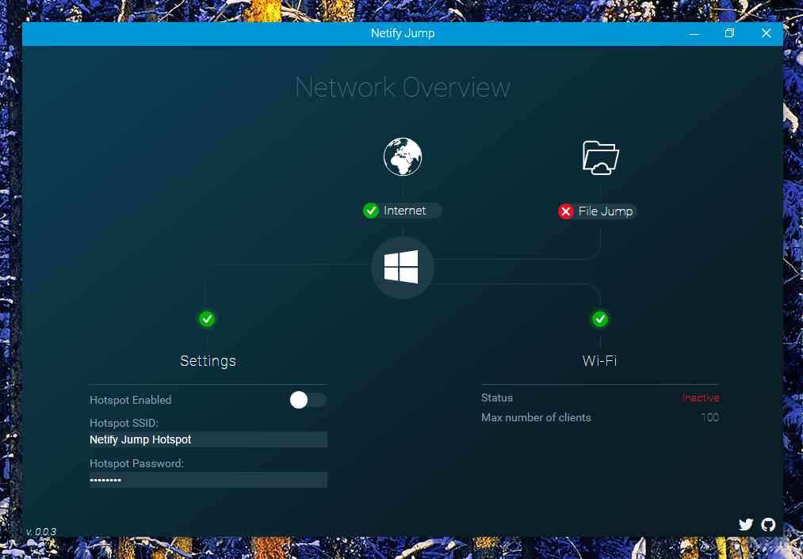
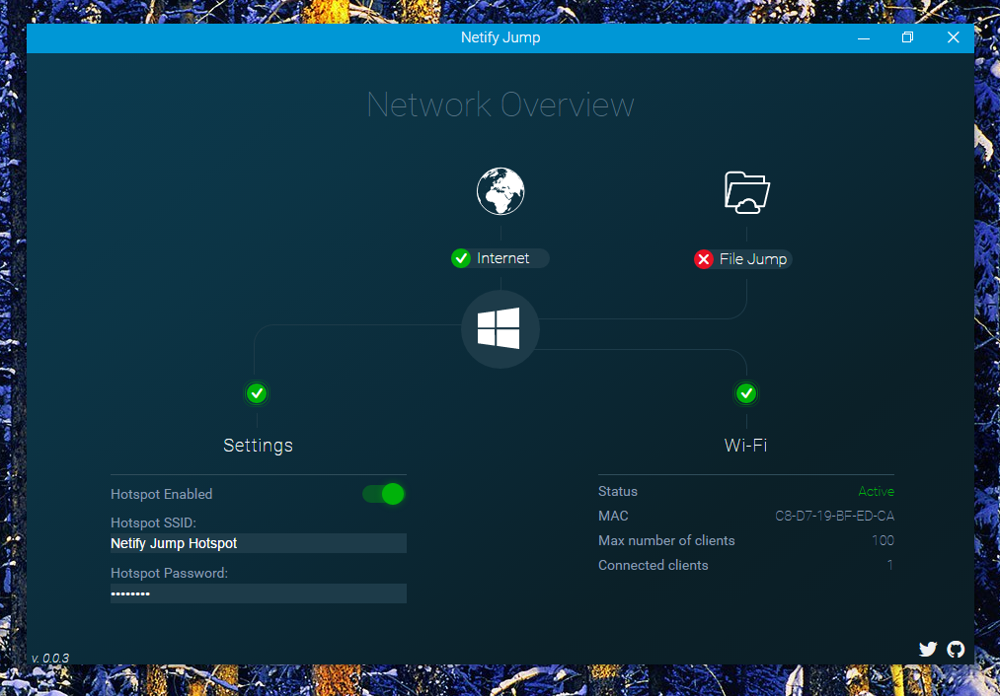

#Netify Jump

 
 
 
 

### What is Netify Jump?

Netify Jump is a software-based system that effectively transforms your computer into a WiFi router and/or repeater. 
  
Netify Jump can broadcast WiFi right from your PC, so that any other WiFi-enabled device can get online. In addition using the built in "File Jump" service devices can beam files to and from other connected devices. 

### Why did I make it?

I feel software such as this should not require large license fees & paid subscriptions for the newest version every year. I believe in open source software and the power that is the community. (I also needed to make a hotspot)

### Can i run it?

Netify Jump requires a computer running Windows 7 or above with a wifi adaptor and/or dongle.  
Mac & Linux support is in the works and coming soon!

### Screenshots

### Where's the beef!

Pre-built binarys & setup files can be found in the [Releases Tab](https://github.com/luigiplr/netify-jump/releases).

 

## Contributing

### Getting Started

- `npm install`

To run the app in development:

- `npm start`

Running `npm start` will download and install [Electron](http://electron.atom.io/).

### Building & Release

- `npm run release`

### Find a bug/issue or simply want to request a new feature?

[Create a Github issue/feature request!](https://github.com/luigiplr/netify-jump/issues/new)

## Copyright and License

Code released under the [GPLv3](LICENSE).
